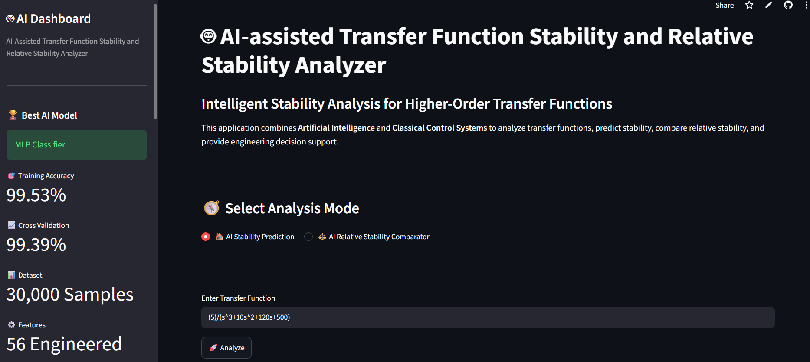
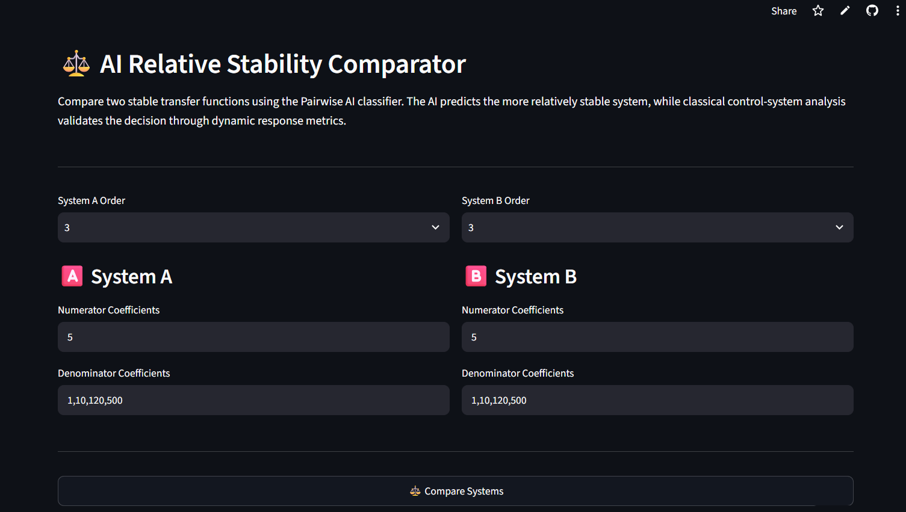

# 🤖 AI-assisted Transfer Function Stability and Relative Stability Analyzer

An intelligent web application that combines **Artificial Intelligence** and **Classical Control System Analysis** to analyze higher-order transfer functions.

The application predicts system stability using Machine Learning, compares the relative stability of two stable transfer functions using a Pairwise AI classifier, and validates AI predictions through classical control-system analysis.

---

## 🚀 Live Demo

🔗 **Web Application**

https://ai-transfer-function-analyzer-fuug6gsszcpbxhdy5smjtf.streamlit.app/

---

# 📌 Project Overview

This project integrates Machine Learning with Control Systems to provide intelligent engineering decision support.

The application supports:

- AI Stability Prediction
- AI Relative Stability Comparison
- Pole Analysis
- Step Response
- Impulse Response
- Pole-Zero Plot
- Stable Interval Detection
- Engineering Recommendation

---

# 🧠 AI Modules

- ✅ MLP Stability Prediction Model
- ✅ Pairwise AI Relative Stability Classifier
- ✅ Confidence Estimation
- ✅ Engineering Recommendation
- ✅ Feature Engineering (56 Features)

---

# ⚙️ Control System Modules

- Pole Analysis
- Step Response
- Impulse Response
- Pole-Zero Plot
- Stability Verification
- Dynamic Response Comparison

---

# 📊 Dataset

- **30,000 Generated Transfer Functions**
- **56 Engineered Features**
- Supports **2nd to 5th Order Systems**

---

# 🏆 Model Performance

| Metric | Value |
|---------|-------|
| Best Model | MLP Classifier |
| Training Accuracy | **99.53%** |
| Cross Validation Accuracy | **99.39%** |

---

# 🛠 Technology Stack

- Python
- Streamlit
- Scikit-Learn
- NumPy
- Pandas
- Matplotlib
- Python Control Systems Library
- Joblib

---

# 🖥 Application Screenshots

## Dashboard



---

## AI Relative Stability Comparator



---

# ✨ Features

- Predict Stability of Higher-Order Transfer Functions
- Compare Relative Stability of Two Stable Systems
- AI Confidence Estimation
- Engineering Recommendations
- Dynamic Response Comparison
- Professional Interactive Dashboard

---

# 📂 Project Structure

```
AI-Transfer-Function-Analyzer
│
├── models/
├── src/
│   ├── app.py
│   ├── predict.py
│   ├── predict_pairwise.py
│   ├── predict_relative.py
│   └── ui/
├── requirements.txt
└── README.md
```

---

# ▶️ Installation

Clone the repository

```bash
git clone https://github.com/ManishaGurugubelli/AI-Transfer-Function-Analyzer.git
```

Install dependencies

```bash
pip install -r requirements.txt
```

Run the application

```bash
streamlit run src/app.py
```

---

# 👩‍💻 Developed By

**Manisha Gurugubelli**

B.Tech (Artificial Intelligence and Machine Learning)

University College of Engineering Kakinada

Jawaharlal Nehru Technological University Kakinada

---

# ⭐ Acknowledgement

Developed as part of an internship project on **AI-assisted Control System Stability Analysis**, integrating Artificial Intelligence with Classical Control Engineering.
